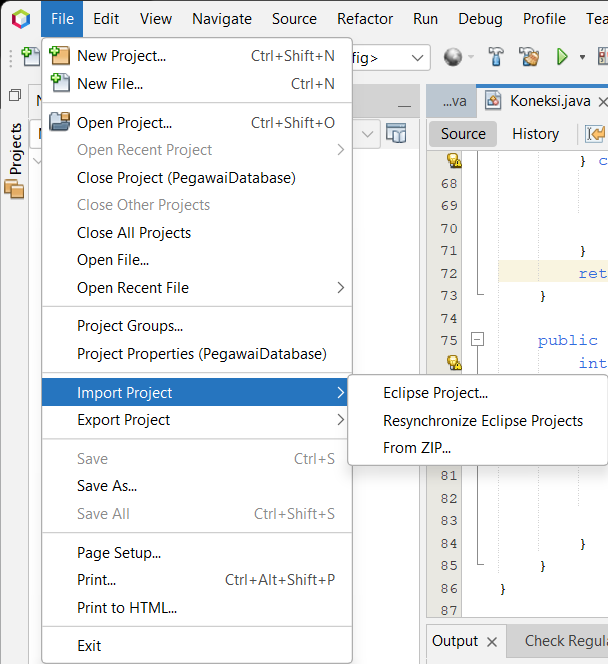
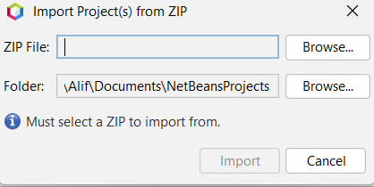
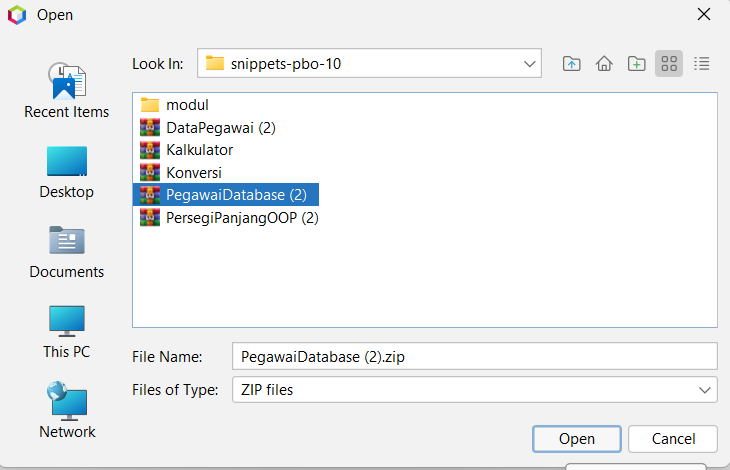
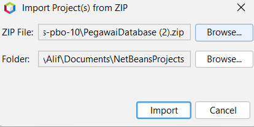

# Panduan Mengimpor Proyek di NetBeans

Berikut adalah langkah-langkah untuk mengimpor proyek dari file ZIP di NetBeans.
## Buat rental user:alif123, pass:123
## Buat projecttoko, admin(user: alif123, pass: 123), pegawai biasa (username:adnan, pass:123)

## Langkah 1: Unduh Proyek

1. **Kunjungi Halaman GitHub**: Pertama, buka halaman GitHub tempat proyek tersedia.
2. **Unduh File ZIP**: Klik pada tombol "Code" berwarna hijau dan pilih opsi "Download ZIP" untuk mengunduh proyek dalam format ZIP.

## Langkah 2: Impor Proyek di NetBeans

1. **Buka NetBeans**: Setelah selesai mengunduh, buka aplikasi NetBeans di komputer Anda.
2. **Klik Menu File**: Di pojok kiri atas jendela NetBeans, klik menu **File**.
3. **Pilih Import Project**: Arahkan kursor ke **Import Project**, kemudian pilih **From ZIP**.
   
   

4. **Telusuri File ZIP**: Setelah itu, akan muncul jendela untuk memilih file. Klik tombol **Browse** untuk mencari file ZIP yang telah Anda unduh sebelumnya.

    

5. **Pilih File ZIP**: Temukan dan pilih file ZIP yang diunduh dari GitHub, lalu klik **Open**.

    

6. **Impor Proyek**: Setelah memilih file, ikuti petunjuk selanjutnya untuk menyelesaikan proses impor proyek.

    

## Langkah 3: Menjalankan Proyek

Setelah proyek berhasil diimpor, Anda dapat membukanya di NetBeans dan mulai menjalankannya dengan menekan tombol **Run** atau memilih **Run > Run Project** dari menu.

## Catatan Tambahan

**Jangan sekali-sekali mengumpulkan langsung project di sini untuk tugas. Ini murni untuk belajar. Resiko penyakahgunaan ditanggung sendiri**
